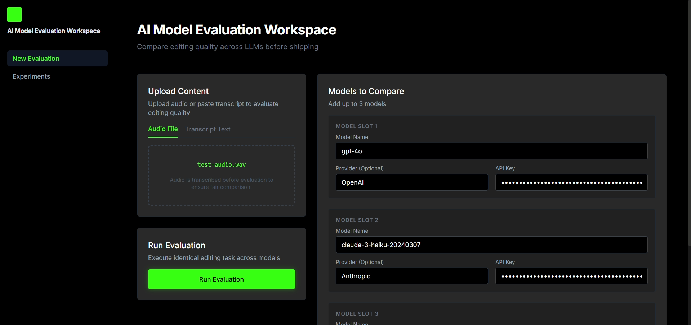
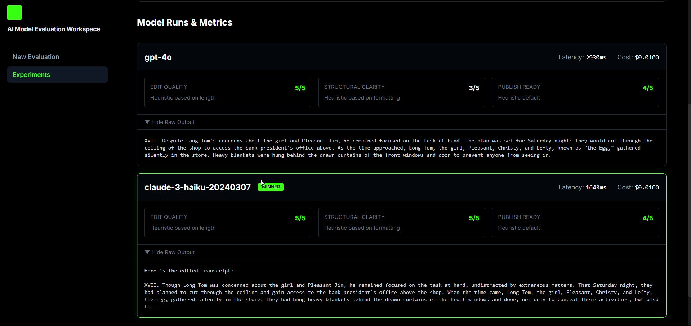
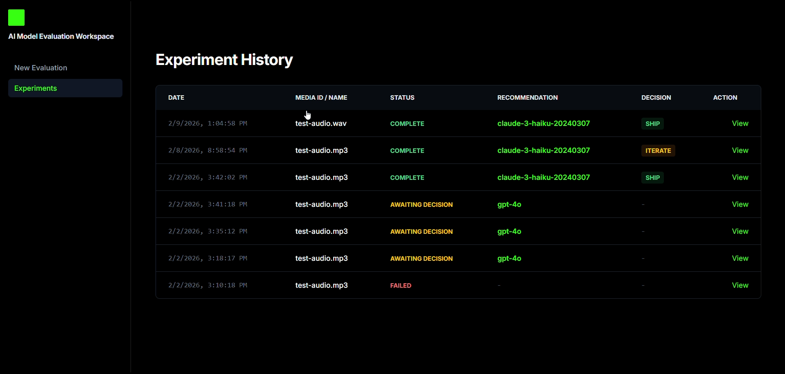

---

# AI Evals Orchestration Platform

A multi-model AI evaluation and experimentation platform designed for creative editing workflows. It enables creators to compare LLM outputs (quality, cost, latency) on transcription and editing tasks side-by-side with human-in-the-loop decision making.

---

## 1. Dashboard Overview

Access the model comparison workspace to configure up to three models side-by-side. Easily upload audio or text and securely configure provider API keys.

<p align="center">
  
</p>

---

## 2. Running a Model Evaluation

Execute evaluations with identical inputs across all models to guarantee a fair comparison. The platform handles parallel prompt execution and secure API key injection.

<p align="center">
  
</p>

---

## 3. Detailed Model Metrics

Analyze model performance using robust scoring heuristics. Each output is evaluated for Edit Quality, Structural Clarity, and Publish Ready status, alongside precise Cost and Latency metrics.

<p align="center">
  
</p>

---

## 4. Experiment History & Decision Layer

Maintain full auditability of all evaluations. The platform enforces human-in-the-loop control by requiring users to make an explicit Ship, Iterate, or Rollback decision.

<p align="center">
  
</p>

---

## Architecture

*   **Backend**: Python **FastAPI** service handling orchestration, AI provider integration, and heuristic evaluation.
*   **Frontend**: **React** (Vite + TypeScript) application for experiment configuration and results visualization.
*   **Persistence**: **Supabase** (PostgreSQL) for storing experiment metadata, run logs, and decisions.
*   **Orchestration**: Asynchronous background workers process transcription, model inference, and evaluation to prevent UI locking.
*   **Isolation**: Individual model failures (e.g., API errors) are isolated, allowing the experiment to continue with remaining successful models.

## Local Setup

### Prerequisites
*   Python 3.10+
*   Node.js 16+
*   Supabase Project (URL & Service Role Key)

### 1. Environment Configuration
Copy the example environment file and fill in your credentials:
```bash
cp .env.example .env
```
Required variables:
*   `OPENAI_API_KEY`: Used for server-side Whisper transcription.
*   `SUPABASE_URL`: Your Supabase project URL.
*   `SUPABASE_SERVICE_ROLE_KEY`: Your Supabase service_role secret (required for backend-only access).

### 2. Backend Setup
```bash
# Install dependencies
pip install -r requirements.txt

# Run the server (auto-reloading)
python -m uvicorn src.api:app --reload
```
API runs at `http://localhost:8000`.

### 3. Frontend Setup
```bash
cd ui
npm install
npm run dev
```
UI runs at `http://localhost:5173`.

### 4. Database Setup (Supabase)
Run the provided SQL schema in your Supabase SQL Editor to create the necessary tables (`experiments`, `model_runs`, `eval_metrics`):
*   _See `schema.sql` included in the repository._

## Usage
1.  Open the UI at `http://localhost:5173`.
2.  Click **New Evaluation**.
3.  Upload an Audio file or paste Text.
4.  Configure up to 3 models (provide ephemeral API keys in the UI for generation models).
5.  Click **Run Evaluation**.
6.  Review results and submit a final decision.

## Simulated Pilot (Design Validation): Case Study

**Scenario**: A creative director wants to automate the first pass of editing raw podcast transcripts into "LinkedIn-ready" posts.

1.  **Input**: The director uploads a 5-minute raw audio file (`draft_recording.mp3`).
2.  **Process**:
    *   The system transcribes the audio using Whisper (Back-end).
    *   **Prompt**: "Edit this transcript for clarity, conciseness, and impact. Maintain original meaning."
    *   The prompt is executed in parallel against **GPT-4o** and **Claude 3 Haiku**.
3.  **Results**:
    *   **GPT-4o**: High structural quality, 3957ms latency, $0.01 cost. Output is polished but slightly verbose.
    *   **Claude 3 Haiku**: Good edit quality, 2547ms latency, $0.00 cost (free tier). Output is punchy but missed one nuance.
4.  **Decision**:
    *   The system heuristically recommends **Claude 3 Haiku** for speed and conciseness.
    *   **Human Review**: The director prefers the GPT-4o structure despite the cost.
    *   **Action**: Director selects **SHIP** on the GPT-4o result.
    *   **Rationale**: "Better formatting for social media reading habits."
5.  **Outcome**: The decision is logged. Future experiments can reference this preference for structure over speed.

## Limitations
*   **Heuristic Evals**: Evaluation scores (`edit_quality`, `structural_clarity`) are currently rule-based heuristics (length, regex), not model-graded.
*   **Infrastructure**: Designed for local execution; orchestration is handled via FastAPI `BackgroundTasks` rather than a distributed queue (Celery/Redis).
*   **Security**: User generation API keys are passed from the client for the session and are not stored persistently in the database, but production deployments should implement a secure vault.
*   **User Feedback Loops**: The platform currently captures explicit human decisions only; future iterations would incorporate implicit user signals (edits accepted, time-to-publish, rework frequency) to continuously refine eval metrics and model selection.
