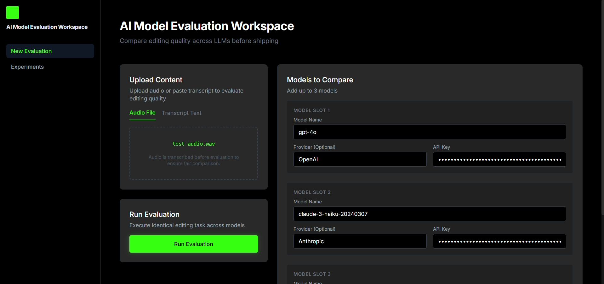
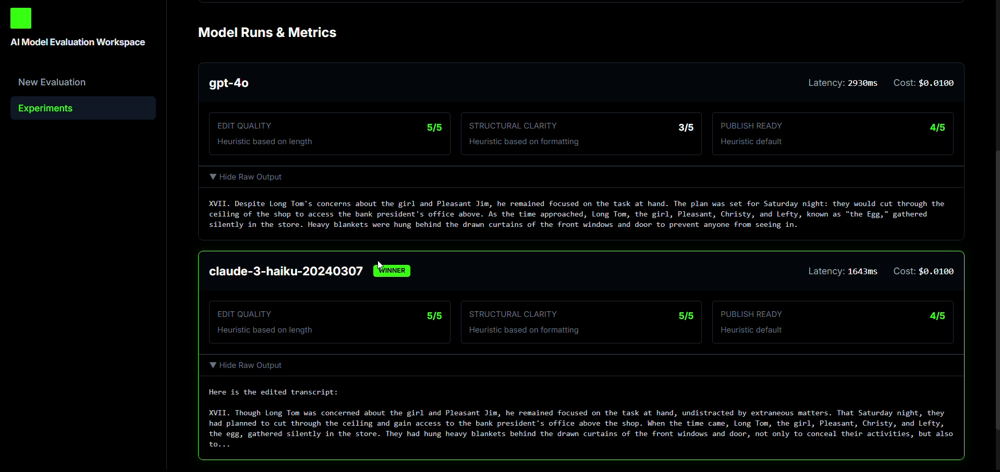
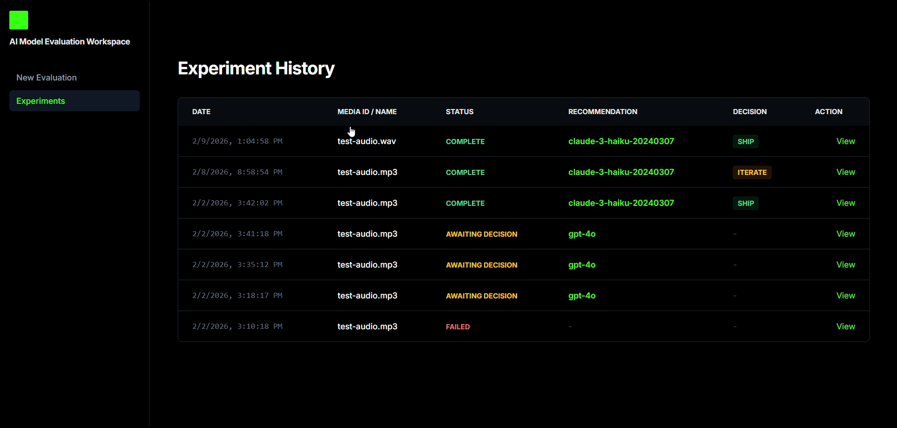

# AI Evals Orchestration Platform

Run identical prompts across multiple LLMs, compare quality, cost, and latency, then make an explicit human decision before shipping.

## What It Does

1. **Transcribe** — upload audio (OpenAI Whisper) or paste text directly.
2. **Run** — send the same prompt to up to 3 models (OpenAI, Anthropic) in parallel.
3. **Evaluate** — score each output with deterministic heuristics (edit quality, structural clarity, publish readiness).
4. **Decide** — review results side-by-side and submit a **Ship / Iterate / Rollback** decision. Nothing auto-ships.

---

## Screenshots

<p align="center">
  
</p>

<p align="center">
  
</p>

<p align="center">
  
</p>

---

## Local Setup

### Prerequisites

- Python 3.10+
- Node.js 16+
- A [Supabase](https://supabase.com) project (URL + Service Role Key)

### 1. Clone and Configure Environment

```bash
cp .env.example .env
# Fill in OPENAI_API_KEY, SUPABASE_URL, SUPABASE_SERVICE_ROLE_KEY
```

### 2. Database

Run `schema.sql` in the Supabase SQL Editor to create the `experiments`, `model_runs`, and `eval_metrics` tables.

### 3. Backend

```bash
pip install -r requirements.txt
python -m uvicorn src.api:app --reload
```

API runs at `http://localhost:8000`.

### 4. Frontend

```bash
cd ui
npm install
npm run dev
```

UI runs at `http://localhost:5173`.

---

## Environment Variables

| Variable | Required | Purpose |
|----------|----------|---------|
| `OPENAI_API_KEY` | Yes | Server-side Whisper transcription |
| `SUPABASE_URL` | Yes | Supabase project URL |
| `SUPABASE_SERVICE_ROLE_KEY` | Yes | Supabase backend access |

Generation model API keys (OpenAI, Anthropic) are entered per-session in the UI and are never stored.

---

## Running Tests

```bash
pytest tests/ -v
```

Tests use mocked AI and database clients — no API keys or Supabase connection required.

---

## Project Structure

```
src/
  api.py          # FastAPI routes
  orchestrator.py # Experiment lifecycle engine
  services.py     # AI provider + Supabase clients
  models.py       # Pydantic models and enums
  main.py         # CLI demo runner
tests/
  test_orchestrator.py  # Unit tests (mocked dependencies)
schema.sql              # Supabase table definitions
.env.example            # Environment variable template
```

---

## Architecture

- **Parallel model invocation** — same prompt, same transcript, different providers
- **Failure-tolerant orchestration** — individual model failures are logged and persisted without crashing the experiment
- **Cost + latency tracked per call**
- **Deterministic heuristic scoring** — rule-based (length, structure, formatting); not model-graded
- **Human-in-the-loop** — mandatory Ship/Iterate/Rollback decision before completion

---

## Limitations

- **Heuristic evals**: Scores (`edit_quality`, `structural_clarity`, `publish_ready`) are rule-based heuristics, not LLM-graded.
- **Local only**: Orchestration runs via FastAPI `BackgroundTasks`, not a distributed queue.
- **Two providers**: OpenAI and Anthropic only. No Google/other providers yet.
- **Security**: User API keys are passed from the UI per-session and not persisted, but production deployments should use a secret vault.
