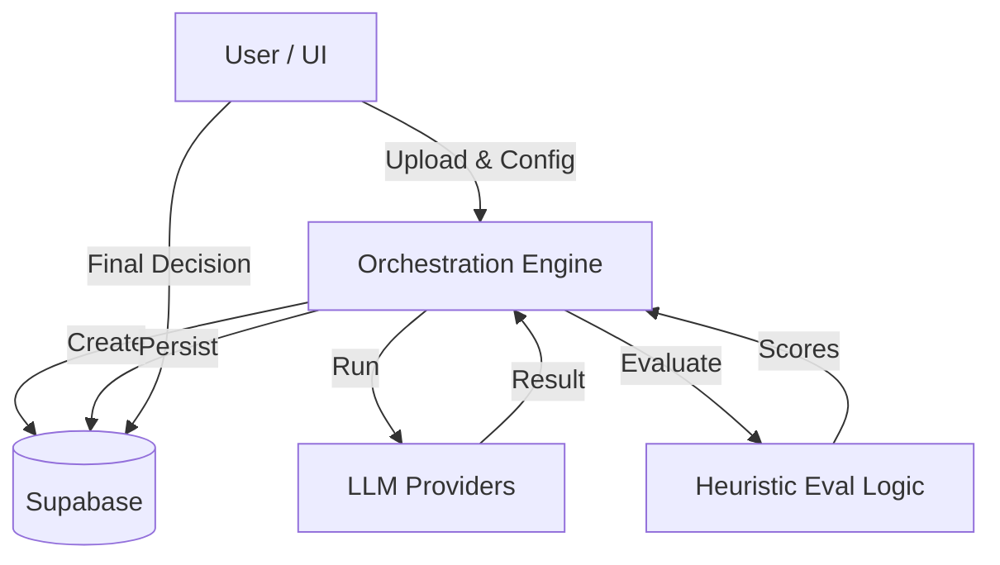

# AI Model Evaluation Workspace - Feature Sheet & Walkthrough

This document outlines the complete system architecture, feature set, and implementation status of the AI Model Evaluation Workspace.

## System Overview
The **AI Model Evaluation Workspace** is an internal enablement tool designed to standardize the evaluation of AI editing quality. It allows creative product teams to compare multiple Large Language Models (LLMs) on identical transcription and editing tasks before shipping features.

## Architecture & Orchestration
The system consists of a Python-based **Orchestration Engine** (Backend) and a React-based **Workspace UI** (Frontend).

### Orchestration Flow (Backend)
The `OrchestrationEngine` (`src/orchestrator.py`) manages the lifecycle of an experiment through 4 distinct phases:

1. **Experiment Creation**
   - Initializes a record in Supabase with `status="running"`.

2. **Model Execution Phase**
   - Takes a list of models (e.g., GPT-4o, Claude).
   - **Transcription**: Uses OpenAI Whisper via `AIProviderService.transcribe_audio` to normalize audio input.
   - **Editing**: Sends the same transcript and prompt to all user-selected models via `FastAPIClient`.
   - **Persistence**: Saves raw outputs, latency, and cost to the `model_runs` table.

3. **Evaluation Phase**
   - Applies a **rule-based heuristic evaluator** (length, structure checks).
   - Scores outputs on structural clarity and edit quality.
   - Persists scores to the `eval_metrics` table.

4. **Comparison & Decision**
   - Generates a heuristic-based recommendation (winner + tradeoffs).
   - **Pauses** for mandatory human decision.
   - Updates status to `COMPLETE` only after Ship / Iterate / Rollback input.

### Data Flow Diagram


## Feature Sheet

### 1. User Interface (Frontend `ui/`)
A polished, internal-tool UI built with **React + Vite + Tailwind**.
*   **Visual Style**: "Charcoal & Neon Green" dark mode. No external branding.
*   **Dual-Mode Input**:
    *   **Audio**: Upload `.mp3` / `.wav`. Triggers "Auto-Transcription" simulation.
    *   **Text**: Paste transcript. Skips transcription step.
*   **Dynamic Model Config**:
    *   3 flexible "Slots".
    *   User defines Model Name (e.g., "Fine-tuned-v2") and API Key.
    *   Keys are masked and passed transiently (never stored).
*   **Results Dashboard**:
    *   Comparative table showing: Quality, Edit Effort, Latency, Cost.
    *   Highlights the "Winner" (mocked logic).
*   **Human-in-the-Loop**:
    *   Forced human decision step (Ship/Iterate/Rollback) required to finish.

### 2. Backend Engine (`src/`)
*   **Strict Typing**: All data flows use Pydantic models (`src/models.py`) to ensure schema compliance.
*   **Resilience**: `FastAPIClient` (`src/clients.py`) implements retries using `tenacity` (2 attempts per call).
*   **Persistence**: `SupabaseClient` handles all DB operations.
    *   **Secrets**: API Keys are handled securely via env vars or user input, never logged.

## Implementation Status

| Component | Feature | Status | Implementation Detail |
| :--- | :--- | :--- | :--- |
| **Data Layer** | Database Schema | ✅ **Real** | SQL schema provided, verified against Supabase. |
| | Models (Pydantic) | ✅ **Real** | `src/models.py` |
| **Logic** | Orchestrator Loop | ✅ **Real** | `src/orchestrator.py` |
| | Error Handling | ✅ **Real** | Retry logic + Status updates on failure. |
| | Supabase Client | ✅ **Real** | Connects to live Supabase instance. |
| **Integrations** | Model Execution | ✅ **Real** | `AIProviderService` uses `openai`/`anthropic`/`google-generativeai` SDKs. |
| | Model Evaluation | ✅ **Real** | Heuristic evaluation implemented in `AIProviderService`. |
| **UI** | Components | ✅ **Real** | React components fully implemented. |
| | Workflows | ✅ **Real** | All user interactions (Upload -> Config -> Run -> Decide) work. |
| | API Connection | ✅ **Real** | `App.tsx` calls `http://localhost:8000` endpoints. |
| | Transcription | ✅ **Real** | `AIProviderService.transcribe_audio` uses OpenAI Whisper. |

## Operation Guide

### 1. Database Setup
Run this SQL in your Supabase SQL Editor to initialize tables:

```sql
create extension if not exists "uuid-ossp";

create table public.experiments (
  experiment_id uuid default uuid_generate_v4() primary key,
  created_at timestamp with time zone default timezone('utc'::text, now()) not null,
  media_id text not null,
  status text not null,
  decision text,
  decision_reason text,
  recommendation text,
  recommendation_reason text,
  tradeoffs jsonb,
  error_log text
);

create table public.model_runs (
  run_id uuid default uuid_generate_v4() primary key,
  experiment_id uuid references public.experiments(experiment_id) not null,
  model_name text not null,
  raw_output text,
  latency_ms integer,
  cost_usd float,
  created_at timestamp with time zone default timezone('utc'::text, now()) not null
);

create table public.eval_metrics (
  eval_id uuid default uuid_generate_v4() primary key,
  run_id uuid references public.model_runs(run_id) not null,
  scores jsonb not null,
  created_at timestamp with time zone default timezone('utc'::text, now()) not null
);
```

### 2. Running the Real Backend
The backend is now a FastAPI server that connects to real AI providers.
```bash
# 1. Install Dependencies
pip install -r requirements.txt

# 2. Set Environment Variables (.env)
# SUPABASE_URL=...
# SUPABASE_SERVICE_ROLE_KEY=...
# OPENAI_API_KEY=... (For Server-side Transcription)

# 3. a) Run the Server
uvicorn src.api:app --reload
```

### 3. Running the Frontend UI
The UI connects to `http://localhost:8000`.
```bash
cd ui
npm install
npm run dev
```
Open the provided `http://localhost...` URL.

### 4. Verification Checklist
- [ ] **Transcription**: Upload an audio file. Confirm it's transcribed via OpenAI Whisper (check console latency).
- [ ] **Models**: Enter valid API keys for models (e.g., `gpt-4o` with key).
- [ ] **Orchestration**: Click Run. Watch status poll from "Running" -> "Complete".
- [ ] **Results**: Verify rows appear in table.
- [ ] **Decision**: Click Ship/Iterate/Rollback. Verify alert confirms success.
