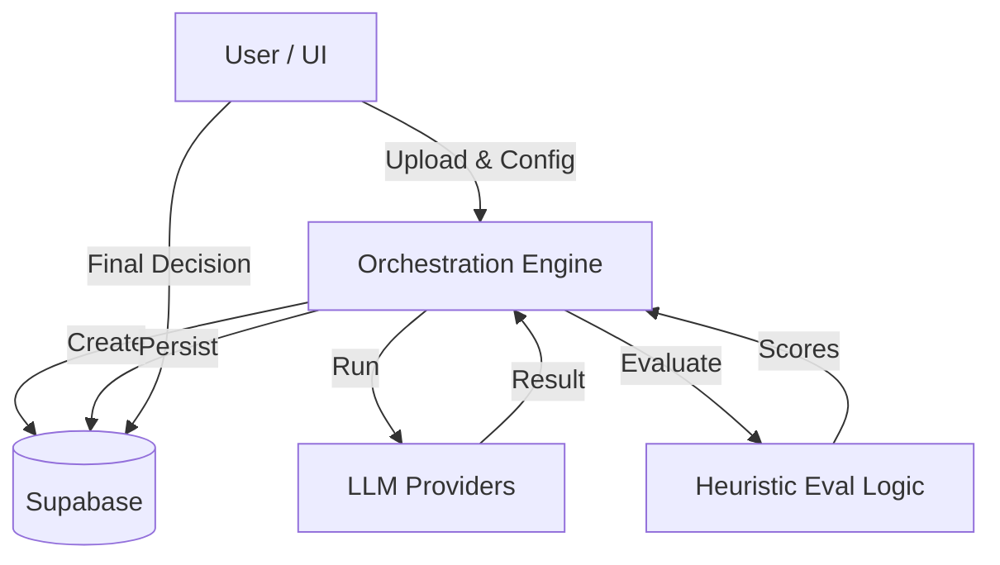

# AI Model Evaluation Workspace - Feature Sheet & Walkthrough

This document outlines the complete system architecture, feature set, and implementation status of the AI Model Evaluation Workspace.

## System Overview
The **AI Model Evaluation Workspace** is an internal enablement tool designed to standardize the evaluation of AI editing quality. It allows creative product teams to compare multiple Large Language Models (LLMs) on identical transcription and editing tasks before shipping features.

## Architecture & Orchestration
The system consists of a Python-based **Orchestration Engine** (Backend) and a React-based **Workspace UI** (Frontend).

### Orchestration Flow (Backend)
The `OrchestrationEngine` (`src/orchestrator.py`) manages the lifecycle of an experiment through 4 distinct phases:

1. **Experiment Creation**
   - Initializes a record in Supabase with `status="running"`.

2. **Model Execution Phase**
   - Takes a list of models (e.g., GPT-4o, Claude).
   - **Transcription**: Uses OpenAI Whisper via `AIProviderService.transcribe_audio` to normalize audio input.
   - **Editing**: Sends the same transcript and prompt to all user-selected models via `FastAPIClient`.
   - **Persistence**: Saves raw outputs, latency, and cost to the `model_runs` table.

3. **Evaluation Phase**
   - Applies a **rule-based heuristic evaluator** (length, structure checks).
   - Scores outputs on structural clarity and edit quality.
   - Persists scores to the `eval_metrics` table.

4. **Comparison & Decision**
   - Generates a heuristic-based recommendation (winner + tradeoffs).
   - **Pauses** for mandatory human decision.
   - Updates status to `COMPLETE` only after Ship / Iterate / Rollback input.

### Data Flow Diagram


## Feature Sheet

### 1. User Interface (Frontend `ui/`)
A polished, internal-tool UI built with **React + Vite + Tailwind**.

- **Visual Style**: Dark mode (“Charcoal & Neon Green”), no external branding.
- **Dual-Mode Input**
  - **Audio**: Upload `.mp3` / `.wav`, triggers Whisper transcription.
  - **Text**: Paste transcript directly and skip transcription.
- **Dynamic Model Configuration**
  - Up to 3 flexible model slots.
  - User supplies model name and API key.
  - Keys are masked, passed transiently, and never stored.
- **Results Dashboard**
  - Side-by-side comparison of quality, latency, and cost.
  - Heuristic recommendation is highlighted.
- **Human-in-the-Loop Control**
  - A **Ship / Iterate / Rollback** decision is required to finalize each experiment.

### 2. Backend Engine (`src/`)
- **Strict Typing**: All request/response flows validated with Pydantic (`src/models.py`).
- **Resilience**: `FastAPIClient` (`src/clients.py`) implements retries using `tenacity`.
- **Persistence**: `SupabaseClient` manages all database reads/writes.
- **Secrets Handling**: API keys are supplied via env vars or runtime input and never logged.

## Implementation Status

| Component | Feature | Status | Implementation Detail |
|---------|--------|--------|-----------------------|
| Data Layer | Database Schema | ✅ Real | SQL schema provided and verified in Supabase |
| | Pydantic Models | ✅ Real | `src/models.py` |
| Logic | Orchestrator Loop | ✅ Real | `src/orchestrator.py` |
| | Error Handling | ✅ Real | Retry logic + per-run failure isolation |
| | Supabase Client | ✅ Real | Live Supabase integration |
| Integrations | Model Execution | ✅ Real | OpenAI / Anthropic SDKs |
| | Model Evaluation | ✅ Real | Heuristic evaluation logic |
| UI | Components | ✅ Real | React components implemented |
| | Workflows | ✅ Real | Upload → Configure → Run → Decide |
| | API Connection | ✅ Real | `App.tsx` → FastAPI |
| | Transcription | ✅ Real | OpenAI Whisper |

## Operation Guide

### 1. Database Setup
Run the following SQL in the Supabase SQL Editor:

```sql
create extension if not exists "uuid-ossp";

create table public.experiments (
  experiment_id uuid default uuid_generate_v4() primary key,
  created_at timestamp with time zone default timezone('utc'::text, now()) not null,
  media_id text not null,
  status text not null,
  decision text,
  decision_reason text,
  recommendation text,
  recommendation_reason text,
  tradeoffs jsonb,
  error_log text
);

create table public.model_runs (
  run_id uuid default uuid_generate_v4() primary key,
  experiment_id uuid references public.experiments(experiment_id) not null,
  model_name text not null,
  raw_output text,
  latency_ms integer,
  cost_usd float,
  created_at timestamp with time zone default timezone('utc'::text, now()) not null
);

create table public.eval_metrics (
  eval_id uuid default uuid_generate_v4() primary key,
  run_id uuid references public.model_runs(run_id) not null,
  scores jsonb not null,
  created_at timestamp with time zone default timezone('utc'::text, now()) not null
);
```

### 2. Running the Real Backend
The backend is now a FastAPI server that connects to real AI providers.
```bash
pip install -r requirements.txt
uvicorn src.api:app --reload
```

### 3. Running the Frontend UI
The UI connects to `http://localhost:8000`.
```bash
cd ui
npm install
npm run dev
```
Open the provided `http://localhost...` URL.

### 4. Verification Checklist
-  Upload audio and confirm Whisper transcription
-  Configure models with valid API keys
-  Run evaluation and observe status progression
-  Verify results and metrics rendering
-  Submit Ship / Iterate / Rollback decision
